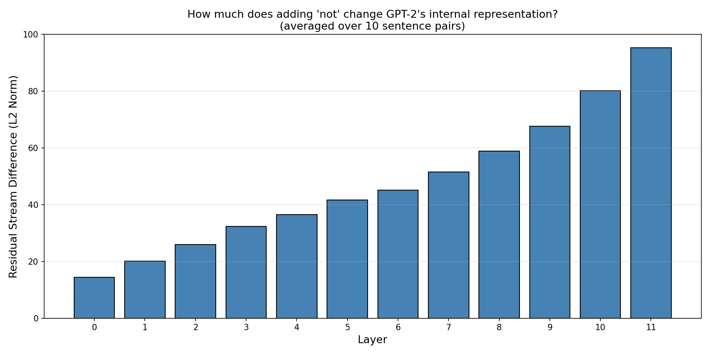
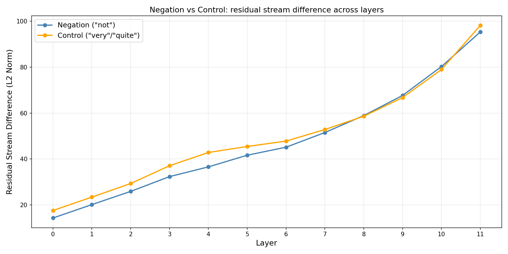
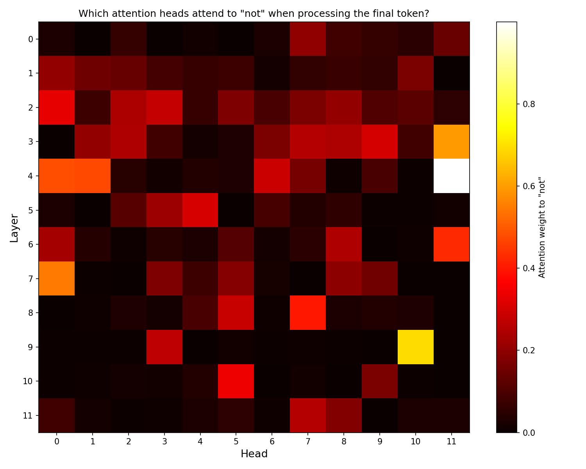
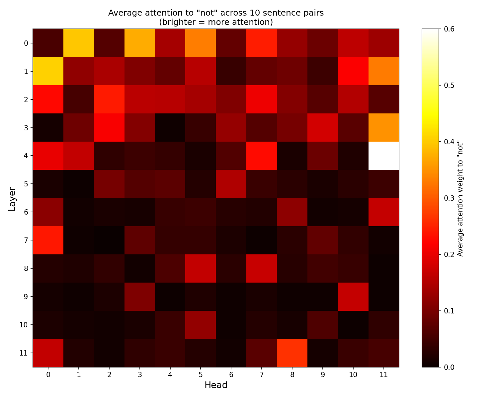

# GPT-2 Negation: A Mechanistic Interpretability Investigation

A hands-on mechanistic interpretability investigation into how 
GPT-2 small internally handles negation - behaviorally, 
representationally, and mechanistically.

## The Core Question

GPT-2 is known to handle negation poorly behaviorally. But why?
Is it that the model never encodes "not" internally - or that it 
encodes it but fails to use it? This project investigates the 
internal mechanism using TransformerLens.

## Major Findings

**Behavioral:** Average top-5 prediction overlap of 3.3/5 between 
positive and negated sentences. GPT-2 partially ignores "not" 
at the output level.

**Residual Stream:** The internal difference between positive and 
negated sentences grows monotonically across all 12 layers - 
from 14.3 at layer 0 to 95.3 at layer 11.

**Control Experiment:** Adding "very" or "quite" produces nearly 
identical residual stream differences to adding "not" - within 
6 L2 units at every layer. The growing difference is not specific 
to negation. It reflects general modifier processing.

**The Puzzle:** "not" and "very/quite" produce almost identical 
internal representations across all 12 layers - yet only "not" 
produces poor behavioral outcomes. The failure lives in the output 
stage, not the representation stage.

**Attention:** Layer 0 Head 0 shows the highest average attention 
to "not" (~0.5–0.6). Attention becomes scattered and diffuse in 
deeper layers. No single head consistently tracks negation 
beyond layer 2.

## Experiments

- Behavioral prediction overlap across 10 positive/negated pairs
- Residual stream L2 norm difference per layer (negation)
- Control experiment: negation vs intensifier residual comparison
- Attention heatmaps across all 144 heads (12 layers × 12 heads)

## Visualizations

## Tools and Setup

- Python 3.11
- TransformerLens
- PyTorch
- Matplotlib / NumPy
- GPT-2 small (117M parameters)

## How to Run

-git clone https://github.com/biplab-inbits/gpt2-negation-mechanistic-interpretability
-cd gpt2-negation-mechanistic-interpretability
-pip install transformer_lens matplotlib numpy
-Open negation.ipynb in Jupyter and run all cells in order

## Full Write-up

Read the complete investigation with analysis on LessWrong:
[LESSWRONG LINK - soon]

## Author

Biplab Aditya : third-year BSc Computer Science student, West Bengal, India.
Preparing for MATS Autumn 2026 (Neel Nanda's mechanistic 
interpretability stream). This is the first of four planned 
MI investigations.